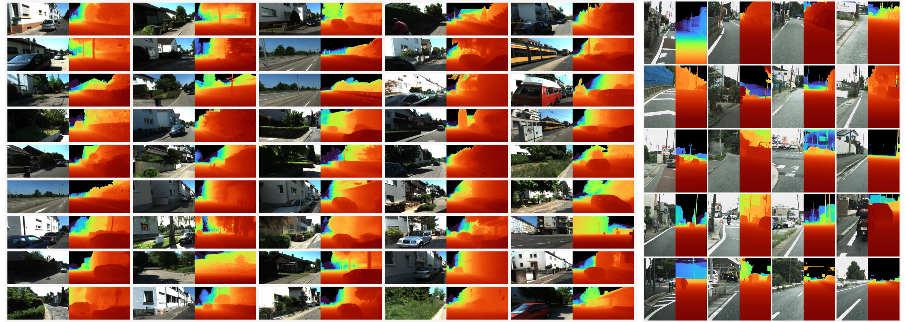

# 1000MDE: A 1000-fps Monocular Depth Estimation Video Dataset with Rendering-and-Stereo Hybrid Annotations

1000MDE is a high-frame-rate benchmark for monocular depth estimation. The dataset is organized around synchronized RGB frames and dense depth maps, with both rendered sequences and stereo-derived sequences prepared for evaluation.



## Dataset

The dataset download link will be updated before release:

[Download 1000MDE Dataset](https://example.com/1000MDE-download-placeholder)

## Data Structure

The current local dataset follows this layout:

```text
1000MDE/
+-- 1000MDE/
    +-- rendering/
    |   +-- 01/
    |   |   +-- rgb/
    |   |   |   +-- img0000.png
    |   |   |   +-- img0001.png
    |   |   |   +-- ...
    |   |   +-- depth/
    |   |       +-- img0000.npy
    |   |       +-- img0001.npy
    |   |       +-- ...
    |   +-- 02/
    |   +-- ...
    +-- stereo/
        +-- 01/
        |   +-- rgb/
        |   |   +-- img0000.png
        |   |   +-- ...
        |   +-- depth/
        |       +-- img0000.npy
        |       +-- ...
        +-- 02/
        +-- ...
```

## Splits

- `rendering`: synthetic/rendered high-frame-rate RGB-depth sequences.
- `stereo`: real-world stereo-derived RGB-depth sequences.

Each sequence folder contains:

- `rgb/`: RGB frames stored as PNG images.
- `depth/`: dense depth maps stored as NumPy arrays.

## Usage

Load RGB frames and depth maps by matching frame indices:

```python
from pathlib import Path
import cv2
import numpy as np

root = Path("1000MDE/1000MDE")
sequence = root / "rendering" / "01"

rgb = cv2.imread(str(sequence / "rgb" / "img0000.png"), cv2.IMREAD_COLOR)
depth = np.load(sequence / "depth" / "img0000.npy")

print(rgb.shape, depth.shape)
```

## Citation

The citation will be added after the paper metadata is finalized.
